# Installing Mods in Custom Locations

By default, ME3 Manager installs mods into your local app data folder. However, you might want to store your mods elsewhere—perhaps on a larger drive or to keep your system organized. 

This guide covers two ways to achieve this: creating a custom profile or using external mod folders.

<!-- more -->

!!! info "Default Location"
    The default mod path is usually `%LOCALAPPDATA%\garyttierney\me3\config\profiles\`.

---

## Choosing Your Method

Depending on your needs, you can move an entire profile's mod directory or simply "link" specific mods from other locations.

=== "Option 1: Custom Profile Location"
    This is the recommended method if you want to move **all** mods for a specific profile to a new drive.

    1. **Open Profile Manager**: Click on the current profile name in the main toolbar and select **Manage Profiles...**.
       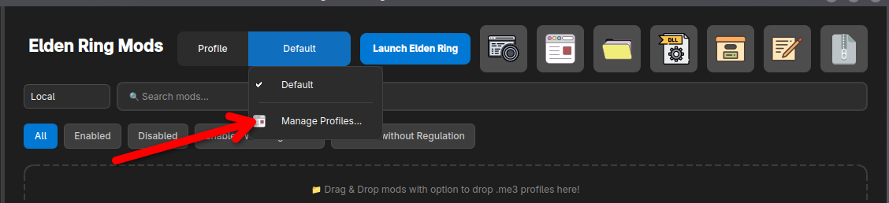
    2. **Add New Profile**: Click the **Add New...** button in the sidebar.
       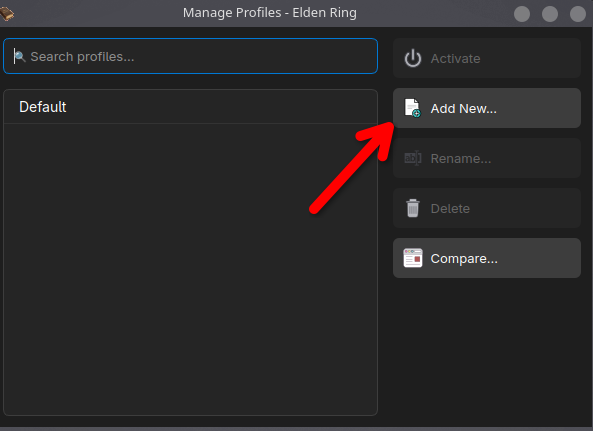
    3. **Set Name**: Enter a name for your profile (e.g., "Custom Profile") and click **OK**.
       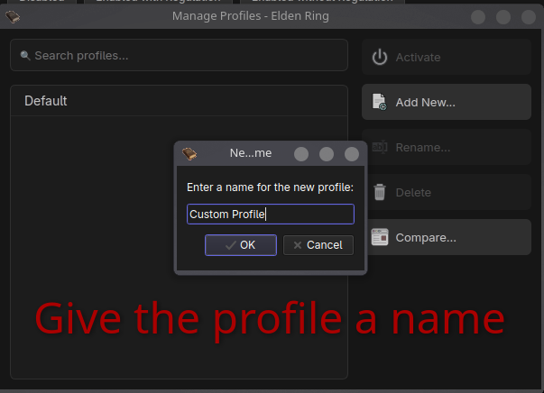
    4. **Select Custom Path**: A file browser will appear. Navigate to your desired location and click **Choose**.
       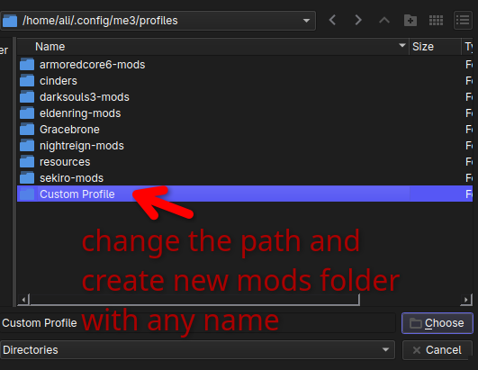
    5. **Finish**: Your new profile is now created and will store all its mods in the selected directory.
       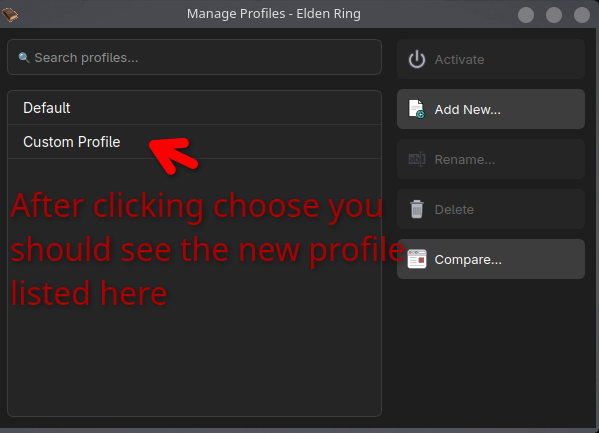

=== "Option 2: External Mod Folders"
    Use this if you have specific mods located elsewhere that you want to reference in your current profile without moving them.

    #### External Native Mods
    For mods that use native file overrides (e.g., `.dll` files).
    
    1. Click the **External Native Mod** (DLL icon) button in the toolbar.
       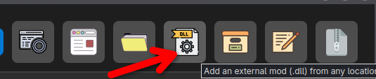
    2. Select the mod file (e.g., `SoulsChat.dll`) and click **Open**.
       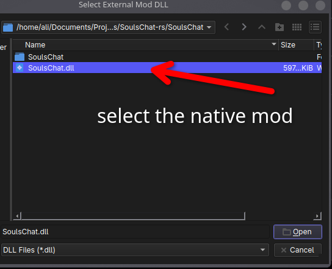
    3. The mod is added to your list with an **"E" badge**, indicating it is an external reference.
       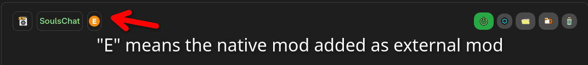

    #### External Package Mods
    For mods packaged as folders or archives.

    1. Click the **External Package Mod** (Folder icon) button in the toolbar.
       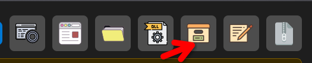
    2. Select the package folder or file and click **Choose**.
       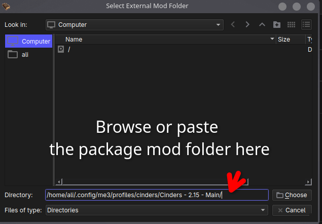
    3. The package is now linked to your profile, also marked with an **"E" badge**.
       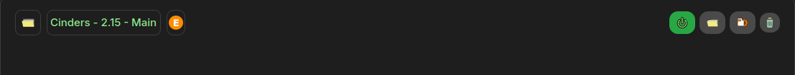

---

!!! tip "Which one should I use?"
    *   **Option 1: Custom Profile** — Recommended if you want to store **all** your mods for a specific profile in a location outside the default folder (e.g., on a larger secondary drive).
    *   **Option 2: External Mod Folders** — Best for sharing the same mod files across multiple profiles without duplicating them. This is also useful if you have already downloaded a mod and want to link it directly to the manager instead of downloading or moving it again.

