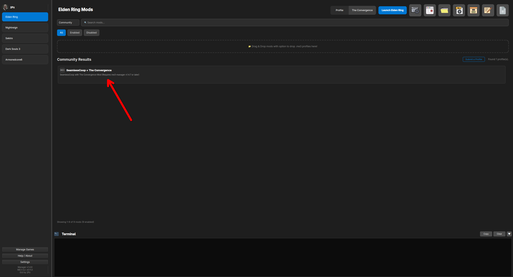
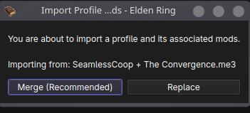
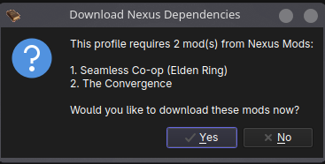
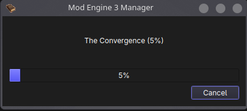
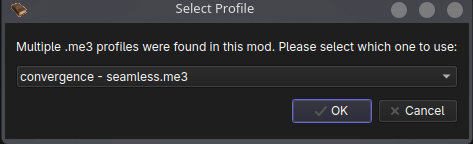
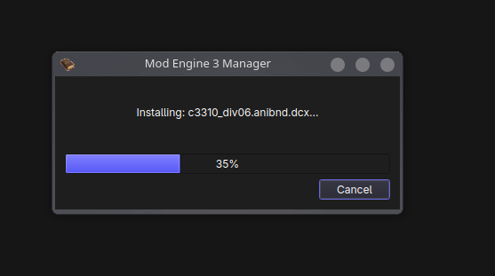
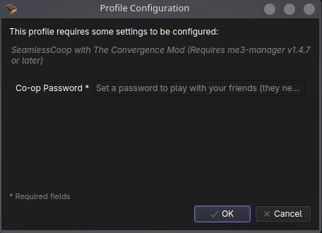
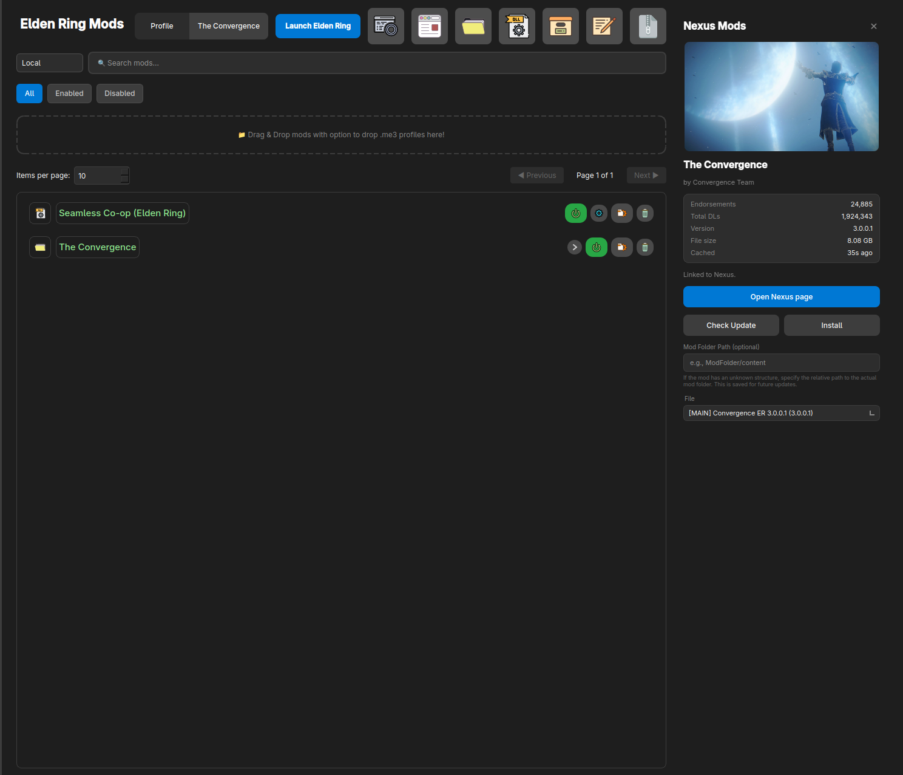

Combining **Seamless Coop** and **The Convergence** is one of the most popular ways to experience the game with friends. In this guide, we'll walk you through the best practices for installing and setting up this combination using ME3 Manager.

<!-- more -->

!!! tip "Recommendation: Use a Dedicated Profile"
    It is highly recommended to create a **new profile** specifically for this setup to avoid conflicts with your other mods. This keeps your mod library organized and makes it incredibly easy to switch between different mod setups on the fly.
    
    Not sure how? Check out our guide to [Create a profile](../../user-guide/profiles.md#create-a-profile).

Once your new profile is ready, you can download the complete setup directly via the **Community Profiles** feature. (Learn more about [Community Profiles](../../user-guide/profiles.md#community-profiles)).

---

### Installation Steps

1. **Locate the Modpack**  
   Navigate to the Community Profiles section and find the "Seamless Coop + The Convergence" setup, then click to download and install.

    

2. **Merge Your Profile**  
   When prompted to either **merge profile** or **replace the current profile**, we highly recommend choosing **Merge Profile**. This ensures that you don't accidentally overwrite any existing mods in your active profile.

    

3. **Confirm the Installation**  
   A dialog box will appear displaying the list of mods about to be installed. Click **Yes** to proceed.

    

    !!! info "Free vs Premium Nexus Mods Accounts"
        Depending on your Nexus Mods account type, the download process may vary. Premium users enjoy automatic downloads, while Free users will need to manually initiate them. Read more about [Free vs Premium Accounts](../../user-guide/installing-mods.md#free-vs-premium-accounts).

4. **Wait for the Download**  
   Allow ME3 Manager some time to fetch and download all the necessary files.

    

5. **Verify the Mods**  
   Once the download is complete, you will see the newly added mods populate in your profile list.

    

6. **Finalizing Installation**  
   Wait for any final background installation or extraction processes to finish completely.

    

7. **Configure Your Multiplayer Password**  
   !!! warning "Crucial Step"
       You **must** configure your **Seamless Coop password** in the mod settings before launching the game. If you and your friends do not have the same password, you will not be able to connect!

    

8. **Ready to Play!**  
   You're all set! You can now hit launch and enjoy playing Seamless Coop + The Convergence. Have fun!

    