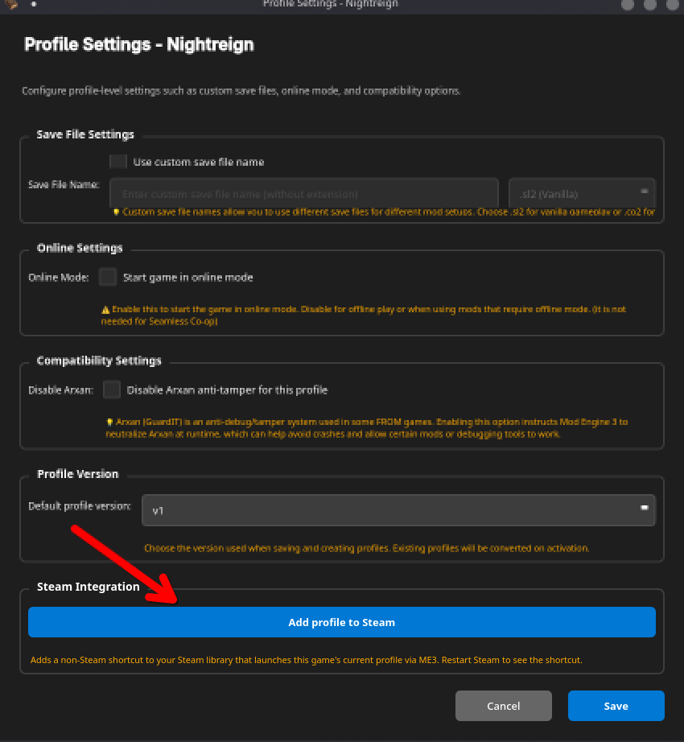

# Game Management

Add or remove games and adjust per‑game settings.

## Add a custom game

1. Open Manage Games.
2. Click Add Game.
3. Fill in required fields (name, mods folder, profile file, CLI ID, executable).

**This feature is intended for future updates where support for new games may be added.**

## Remove a game

1. Open Manage Games.
2. Select a game → Remove → Confirm.

## Game options (details)

### ME3 Configuration File

- **Open Folder**: View the `me3.toml` file.
- **Change Location**: Choose a different folder for ME3 settings.

### Game Options

- **Skip Logos**: Faster startup by skipping intro logos.
- **Boot Boost**: Optimize and speed up initial loading.

### Steam Directory

- **Use custom Steam directory**: Use this only if ME3 cannot detect Steam automatically.

### Custom Executable

- **Use custom executable path**: Use this only if ME3 cannot detect the game automatically; select the game’s `.exe`.

## Steam Shortcuts

You can add a shortcut to your Steam library that launches the game with the selected profile and mods active.

1. Open **Profile Settings** (profile icon in the header).
2. Click **Add to Steam**.
3. A non-Steam shortcut will be created in your Steam library.

!!! note
    This feature requires Steam to be installed and detected by ME3 Manager.
