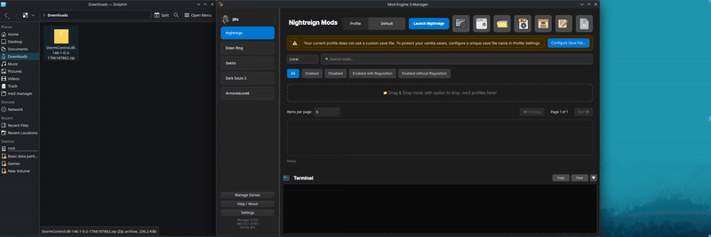

# Installing Mods

ME3 Manager offers powerful tools to make installing mods easy. The recommended methods are using the built-in **Nexus integration** or **Drag-and-Drop** with automatic metadata parsing.

## 1. Nexus Mods (Recommended)

The easiest way to install mods is directly through the built-in Nexus Mods integration.

1.  Ensure you are [logged in](nexus-integration.md).
2.  Switch the search source to **Nexus** in the search bar.
3.  Type a mod name, ID, or paste a Nexus URL and press **Enter**.
4.  Select a mod to view details in the sidebar.
5.  Click **Install** to download and install the mod automatically.


### Free vs Premium Accounts

- **Premium Users**: Downloads start automatically via the API.
- **Free Users**: A browser window will open to the download page. Click "Slow Download", and ME3 Manager will detect the file in your **Downloads** folder and install it automatically.

## 2. Drag and Drop

You can install mods by simply dragging files into the manager. This is the best method if you have already downloaded the files manually.

### Smart Nexus Detection
If you drag a **zip/rar/7z archive** downloaded from Nexus Mods (e.g., `ModName-12345-1-0-123456789.zip`), ME3 Manager will:

1.  **Parse the filename** to identify the Mod ID.
2.  **Fetch metadata** (Author, Version, Description) from Nexus automatically (if logged in).
3.  **Enable update tracking** for the mod.
4.  **Install** the mod correctly.



### Supported Drop Items
- **Archives (.zip, .rar, .7z)**: Installs the mod inside.
- **Directories**: Installs the folder as a mod.
- **.me3 Profiles**: Installs the profile and any associated mod data.
- **DLL files**: Installs as a DLL mod.
- **Regulation.bin**: Installs game regulation files.

## 3. Manual Installation (Advanced)

For advanced users or custom mod structures, you can manually place files, but it is recommended to use Drag and Drop to ensure proper tracking.

## Mod Structure Guide

ME3 Manager works best when a mod includes a `.me3` profile file or follows one of the standard structures below.

### Native DLL Mod
A typical DLL mod should have the `.dll` file and its configuration folder at the same level.

```text
└── Storm Control
    ├── StormControl
    │   ├── config.ini
    │   └── profiles
    │       └── Example.ini
    └── StormControl.dll
```

### Package Mod
For mods that modify game assets (e.g., overhauls), the following structure is recommended for standard game folders:

```text
Nightfarer Bots
├── event
│   ├── common_func.emevd.dcx
│   ├── m18_00_00_00.emevd.dcx
│   └── ...
├── map
│   ├── m18
│   │   └── m18_00_00_00
│   │       └── m18_00_00_00_0000.btl.dcx
│   └── mapstudio
│       ├── m18_00_00_00.msb.dcx
│       └── ...
├── msg
│   └── engus
│       └── item.msgbnd.dcx
└── regulation.bin
```
