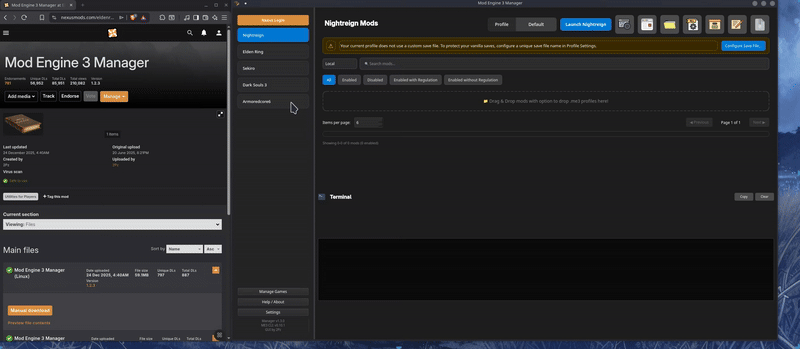
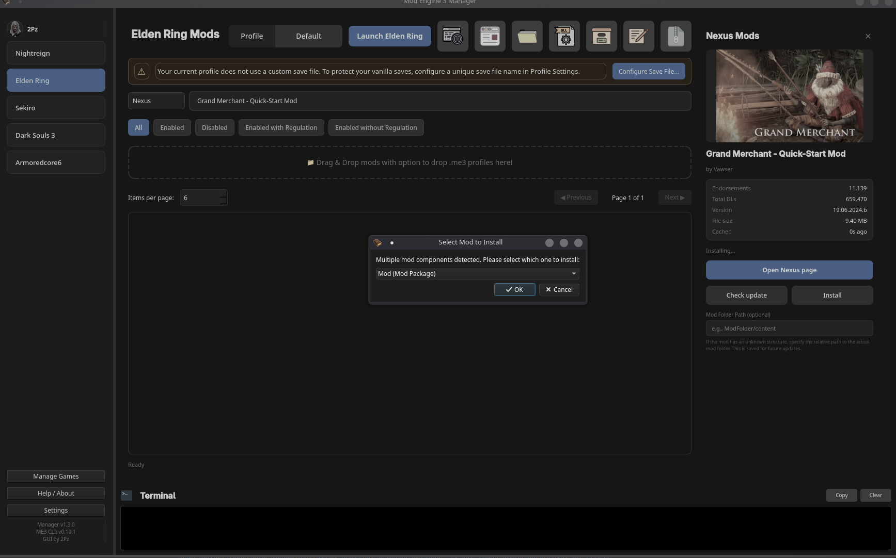

# Installing Mods

ME3 Manager supports drag-and-drop installation for various mod types.

## Drag and drop

1. Select a game in the sidebar.
2. Drag a mod file or folder into the main area.
3. Follow the prompts to complete the installation.

## Supported types

- **DLL files** (.dll)
- **Mod folders**
- **Regulation files** (.bin)

### 1) DLL mod example

For example, installing the Storm Control mod:

- Drag the `.dll` file into the drop zone.


### 2) Package mod example

Some mods include a `.me3` profile and a `mods` folder (e.g., a large overhaul).

- Drag only the `.me3` file, or both the `.me3` file and the folder together.
- If there is no `.me3` file, drag the folder.


### 3) Regulation.bin

Some mods contain only a `regulation.bin` file.

- Drag it into the drop zone.
- **Note**: Only one regulation file can be active at a time.


## Nexus Mods Installation

ME3 Manager allows you to search and install mods directly from Nexus Mods.

1. Ensure you are [logged in](nexus-integration.md).
2. Switch the search source to **Nexus** in the search bar.
3. Type a mod name, ID, or paste a Nexus URL and press **Enter**.
4. Select a mod to view details in the sidebar.
5. Click **Install** to download and install the mod automatically.



!!! tip "Mod Root Path (Optional)"
    ME3 Manager automatically attempts to find the correct mod folder within an archive. However, if the archive contains multiple potential root folders, the manager will ask you which one to install (e.g., the specific mod folder vs. the entire archive).

    You can also manually specify a **Mod Root Path** in the Nexus details sidebar. This is useful for archives with nested structures, allowing the manager to install only the relevant files and skip everything else. This setting is remembered and applied automatically when updating the mod.

    **Example: Grand Merchant - Quick-Start Mod**
    ```text
    Grand Merchant - Quick-Start Mod
    ├── Mod
    │   ├── event
    │   ├── map
    │   ├── msg
    │   └── script
    └── modengine2
        ├── assets
        ├── bin
        └── ...
    ```
    In this case, the manager will ask if you want to install the `Mod` folder or the entire directory. It is best to choose only the **Mod** folder to keep your installation clean and avoid unnecessary Mod Engine binaries.

    

## Updating Mods

Mods installed via Nexus are automatically tracked for updates.

- Select a mod and open the details sidebar to check for updates.


## Recommended Mod Structure

ME3 Manager works best when a mod includes a `.me3` profile file or follows one of the standard structures below.

### Native DLL Mod
A typical DLL mod should have the `.dll` file and its configuration folder at the same level.

```text
└── Storm Control
    ├── StormControl
    │   ├── config.ini
    │   └── profiles
    │       └── Example.ini
    └── StormControl.dll
```

### Package Mod
For mods that modify game assets (e.g., overhauls), the following structure is recommended for standard game folders:

```text
Nightfarer Bots
├── event
│   ├── common_func.emevd.dcx
│   ├── m18_00_00_00.emevd.dcx
│   └── ...
├── map
│   ├── m18
│   │   └── m18_00_00_00
│   │       └── m18_00_00_00_0000.btl.dcx
│   └── mapstudio
│       ├── m18_00_00_00.msb.dcx
│       └── ...
├── msg
│   └── engus
│       └── item.msgbnd.dcx
└── regulation.bin
```
