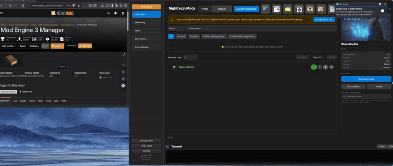

# Nexus Mods Integration

ME3 Manager features deep integration with Nexus Mods, allowing you to search, download, and track updates for mods directly within the application.

## Setup and Login

To use Nexus Mods features, you need to log in to your account through the application.

1. Click the **Nexus Login** button at the top of the left sidebar.
2. A dialog will appear, and a browser window will open automatically.
3. Log in to your Nexus Mods account in the browser if prompted.
4. Click **Authorize** to allow ME3 Manager to access your account.
5. Once authorized, the browser will close, and you will be logged in within ME3 Manager.

!!! tip
    For instructions on how to find and install mods via Nexus, see the [Installing Mods](installing-mods.md#nexus-mods-installation) guide.
