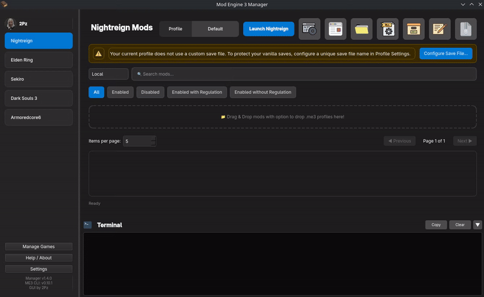

# Profiles

Profiles let you save different mod combinations and switch between them.

## Examples

- Vanilla+: few QoL mods
- Heavy Mods: gameplay overhaul
- Testing: temporary setups

## Create a profile

1. Open Manage Profiles
2. Click Add Profile
3. Name it → Save

## Switch profiles

- Use the profile dropdown to change the active profile
- Each profile remembers which mods are enabled

## Profile options

## Steam integration for profile shortcuts

allows you to create Steam shortcuts for your profiles. This is especially useful if you prefer running ME3 directly from Steam ( **without using the ME3 Manager GUI** ).

After adding the profile, you will need to **restart Steam** for the changes to take effect. Once restarted, you’ll see the profile listed in Steam as a non-Steam game.

## Community Profiles

ME3 Manager integrates directly with the community repository to provide curated mod lists and profiles.

1.  Locate the **Search Source** dropdown in the main search bar (set to **Local** by default).
2.  Switch it to **Community**.
3.  Browse available profiles and mod lists.
4.  Click **Install** on any profile to download and add it to your local profiles.
    - **Note**: Some profiles are full mod packages, while others are simple mod lists.

This feature allows you to quickly set up popular mod configurations without manual setup.

