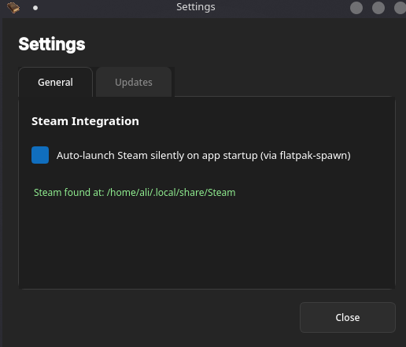
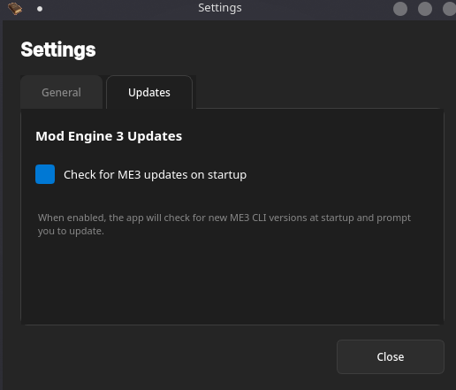

# Settings

Configure global application preferences.

### Steam Integration

- **Auto-launch Steam**: Automatically launches Steam when ME3 Manager starts (if not running).
    - *Windows*: Toggles auto-launch for Windows.
    - *Linux*: Toggles auto-launch for Linux.
- **Status**: Displays whether the Steam installation path was detected.

### ME3 Updates

- **Check for updates**: Automatically checks for new versions of the ME3 CLI tool on startup.

